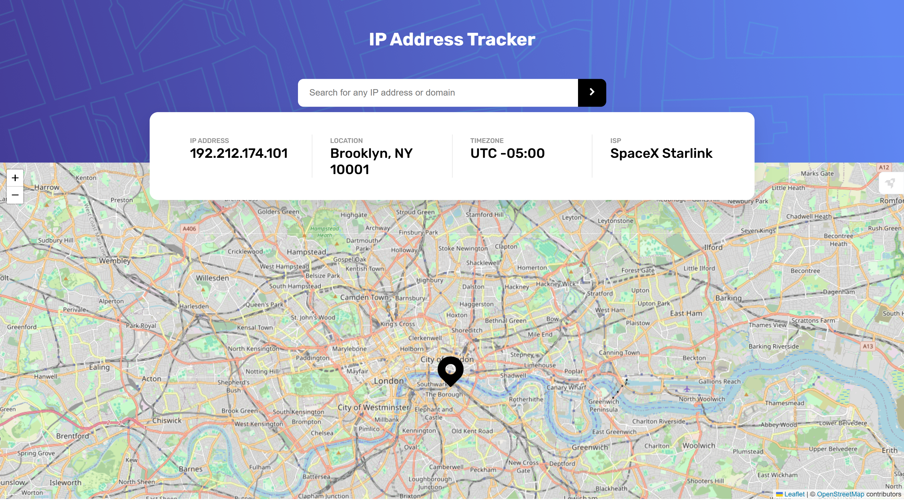

# Frontend Mentor - IP address tracker solution

This is a solution to the [IP address tracker challenge on Frontend Mentor](https://www.frontendmentor.io/challenges/ip-address-tracker-I8-0yYAH0). Frontend Mentor challenges help you improve your coding skills by building realistic projects. 

## Table of contents

- [Overview](#overview)
  - [The challenge](#the-challenge)
  - [Screenshot](#screenshot)
  - [Links](#links)
- [My process](#my-process)
  - [Built with](#built-with)
  - [What I learned](#what-i-learned)
  - [Continued development](#continued-development)
  

## Overview

### The challenge

Users should be able to:

- View the optimal layout for each page depending on their device's screen size
- See hover states for all interactive elements on the page
- See their own IP address on the map on the initial page load
- Search for any IP addresses or domains and see the key information and location

### Screenshot

### Links

- Solution URL: [https://github.com/29kanan/IP-Address-Tracker.git](https://github.com/29kanan/IP-Address-Tracker.git)
- Live Site URL: [https://695e5fffebd1c66726b05a32--my-ip-address-tracker.netlify.app/](https://695e5fffebd1c66726b05a32--my-ip-address-tracker.netlify.app/)

## My process

### Built with

- HTML/CSS
- JavaScript
- Leaflet.js (Map Library)
- Ipify API

### What I learned

- API Integration: I learned how to use fetch() to retrieve location data from the Ipify API based on user input.
- Leaflet.js Basics: I learned how to initialize map and place a custom marker at specific coordinates ($latitude, longitude$).

### Continued development

- Multi-IP Comparison: Users will be allowed to search for several IPs and see them all on the map at the same time to compare distances.
- Map Customization: I am planning to add a 'Theme Switcher'where users can choose between different map styles, like "Dark Mode" or "Satellite View".

